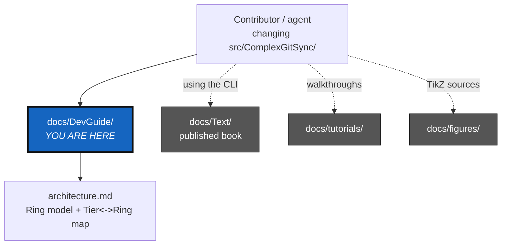

# DevGuide

*Created: 2026-08-31*

## Abstract — read this first

**What this document is.** The index for `docs/DevGuide/` — a small,
Markdown+Mermaid folder that explains how `src/ComplexGitSync/` itself is
put together, for people about to change it.

**Why it exists.** Three other doc trees already live under `docs/`, and
none of them is this one. `docs/Text/` is the published, LaTeX-built user
book (`docs/MASTER.pdf`) — narrative chapters aimed at people *using*
ComplexGitSync. `docs/tutorials/` is task-shaped walkthroughs, also
user-facing. `docs/figures/` holds the TikZ sources those book chapters
`\input`. None of the three ever documents the codebase's internal
`Ring:`-based import-direction rules — those lived only in
`.agent/.local/.localSpec/AdditionalSpecs.md` and each module's own docstring header, invisible to
anyone reading the book.
`docs/DevGuide/` is the missing dev-facing home for that model, with the
diagrams the code split never got. See
`.agent/.local/.localSpec/DevTickets/archive/20260831_DocRewritePlanTicket.md` for the full rationale.

**What you will find.** One other file so far:
[`architecture.md`](architecture.md) — the Ring model, how it relates to
the book's Tier model, a dependency graph of the current module set grouped
by ring, and a one-row-per-module contract table.

**Who it is for.** Contributors and coding agents working on
`src/ComplexGitSync/` itself — not end users of the `cgitsync` CLI (they
want `README.md` or `docs/Text/`), and not people building the LaTeX book
(they want `docs/Text/` and `docs/figures/` directly).

**What you need to do with it.** Read `architecture.md` before moving a
module between rings or adding a new one; it links out to
`.agent/.local/.localSpec/AdditionalSpecs.md`, which stays the enforced, authoritative
source for the import rules themselves.

**Where the planning went.** This folder describes how the code *is*. What
is *planned* — the ranked planning tickets, the archive of finished ones,
and the owner's short tickets they come from — lives in
`.agent/.local/.localSpec/DevTickets/`, a private mount that only the developer install
(`examples/complexgitsync4dev.cgs`) brings in. It used to sit in the public
repository as `AgentSpec/`; it moved so that installing the tool ships the
tool, not the workshop. If you have the developer tree, start at
`.agent/.local/.localSpec/DevTickets/README.md`; if you do not, nothing in this folder
depends on it.

---

## In this folder

| File | Covers |
|---|---|
| [`architecture.md`](architecture.md) | The Ring model, the Tier↔Ring mapping, a per-ring module dependency graph, a one-row-per-module contract table, and a condensed pointer to `.agent/.local/.localSpec/AdditionalSpecs.md`'s import rules and ceilings. |

This folder is deliberately small — an index plus one substantive file, not
a second architecture book. New dev-facing diagrams belong in
`architecture.md` unless they grow large enough to earn their own file, in
which case add a row here rather than nesting content inside
`architecture.md` indefinitely.
