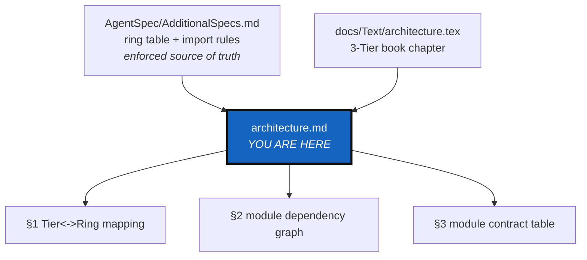

# Architecture — the Ring model, and how it relates to the Tier model

*Created: 2026-08-31*

## Abstract — read this first

**What this document is.** The dev-facing companion to
`docs/Text/architecture.tex` (the published, user-facing "Three-Tier
Architecture" book chapter). This file documents the **Ring** model instead:
the enforced, import-direction/I/O-boundary grouping that
`src/ComplexGitSync/`'s modules actually declare in their own docstring
headers and that `AgentSpec/AdditionalSpecs.md`'s "Architectural Overview"
section states as rules.

**Why it exists.** The isolation refactor
(`AgentSpec/archive/20260828_Isolation_DevPlanTicket.md`) split
`orchestre.py`/`cli.py` into ~20 focused modules and gave each one a
`Ring:` docstring header, but never added anywhere in `docs/` that shows
those rings, how they relate to the book's Tier model, or how the current
module set actually depends on itself. `AgentSpec/AdditionalSpecs.md`'s
ring table is dev-facing but text-only — no diagram. This file is that
diagram, plus the one explicit Tier↔Ring reconciliation
`AgentSpec/20260831_DocRewritePlanTicket.md` §1.1 calls for.

**What you will find.** The Tier↔Ring mapping (§1); a Mermaid dependency
graph of every current module, grouped by ring (§2); a one-row-per-module
contract table pulled from each module's own docstring header (§3); and a
condensed pointer to `AgentSpec/AdditionalSpecs.md`'s four import rules and
ceiling ratchet (§4) — `AgentSpec/AdditionalSpecs.md` stays authoritative
for those, this file only summarizes.

**Who it is for.** Contributors and coding agents about to add, move, or
re-rank a module in `src/ComplexGitSync/` — read this before deciding which
ring new code belongs in, or before wiring a new internal import.

**What you need to do with it.** Nothing by default. Update §2's graph and
§3's table when a module is added, removed, renamed, or moved between
rings — same discipline `CLAUDE.md` already asks for
`AgentSpec/AdditionalSpecs.md`.

---

## 1. The Tier↔Ring mapping

`docs/Text/architecture.tex` describes **three Tiers** — a *lifecycle-role*
grouping, aimed at readers of the published book:

- **Tier 1 — Core Data**: the reference model centred on `GitTree`/`GitRepo`
  identities and the `WorkingGitTree` runtime graph.
- **Tier 2 — Actions**: operations that read or mutate Tier 1, each gated
  by the current `TreeLifecycleState`.
- **Tier 3 — Client/API**: `ComplexGitSyncClient`/`Orchestre`, the single
  public facade that gates every action and coordinates the tree's
  lifecycle end to end.

`AgentSpec/AdditionalSpecs.md` describes **five Rings** — an *import-direction/I/O-boundary*
grouping, mechanically checked by `scripts/check_module_ceilings.py`: a
module may import only from a lower-numbered ring, `subprocess` is confined
to `git_runner.py` alone, Ring 0 does no I/O at all, Ring 1 does no
`subprocess`.

**These two groupings do not collapse 1:1** — they slice the same module
set along different axes, and conflating them is exactly the confusion
this document exists to resolve:

| Tier (lifecycle role) | Ring (import direction / I/O boundary) |
|---|---|
| **Tier 1 — Core Data** | Ring 0 identity/exception types (`errors.py`, `git_repo.py`) plus the Ring 1 part of the runtime graph (`git_tree.py`, and — as workspace-local identity, not project spec — `master.py`). |
| **Tier 2 — Actions** | Split across three rings by I/O boundary rather than living in one: Ring 1 filesystem-only helpers (`paths.py`, `discovery.py`, `state_store.py`, `snapshot_resolver.py`, `ledger_store.py`), and Ring 2 Git-process operations (`operations.py`, `registry.py`, `git_runner.py`). |
| **Tier 3 — Client/API** | Ring 3 exactly: `orchestre.py` (`Orchestre`, `ComplexGitSyncClient`). |
| *(no Tier — book never described a CLI adapter layer)* | **Ring 4**: the `cli/` package. The book's Tiers describe runtime coordination of `.cgs`/`.gts` state; argument parsing and prompt collection sit entirely outside that model, one layer further out than Tier 3. |

Two more precisions, stated so this mapping doesn't quietly rot into a
false 1:1 impression:

- **The book's own module-layout figure already has a fourth, cross-cutting
  bucket** alongside the three Tiers — a "Document layer" holding
  `config_document.py`, `cgs_format.py`, the `.gts` document type, and
  `errors.py` (`docs/Text/architecture.tex`, §"Module Layout by Tier"). That
  cross-cutting layer is Ring 0 today (`errors.py`, `config_document.py`)
  plus the two modules that carry a co-located Ring-1 I/O adapter on the
  same class (`cgs_format.py`, `gts_document.py` — see §3 for why).
- **Six Ring 0–2 modules postdate the book chapter entirely** and have no
  Tier counterpart to map to at all: `integrity.py`, `ledger_entry.py`,
  `ledger_store.py` (the `.lgr` hash-chained register behind `cgitsync
  verify`), and `status_render.py`, `snapshot_resolver.py`,
  `config_document_io.py` (extractions that used to be inline in the old
  `cli.py`/`orchestre.py`/`config_document.py`, pulled out during the
  isolation work for testability, not for a lifecycle reason the Tier model
  ever named). They are real, ring-classified, enforced code — just not
  something `architecture.tex` had a slot for when it was written.

If this reads as "Tier answers *what role*, Ring answers *what may this
import*" — that is the whole reconciliation. Neither model is wrong; they
were never answering the same question.

---

## 2. Module dependency graph, by ring

Every module in `src/ComplexGitSync/` (including the `cli/` subpackage),
grouped by its own `Ring:` docstring header, with an edge for every real
internal `from .x import y` — no fabricated edges. `errors.py`,
`master.py`, `state_store.py`, and `snapshot_resolver.py` have no internal
imports at all (each declares `Imports: none` or "stdlib only") and appear
as leaf nodes with no outgoing arrow. `orchestre.py` (Ring 3) is the widest
fan-out by design — it is the one module allowed to import from every ring
below it. `__init__.py` and `__main__.py` carry no `Ring:` header (package
assembly / entry-point stub, not ring-classified) and are omitted here; see
§3 for both.

```mermaid
graph TD
    subgraph R4["Ring 4 — ADAPTER"]
        cli_init["cli/__init__.py"]
        cli_minimalist["cli/minimalist.py"]
        cli_configuration["cli/configuration.py"]
        cli_expert["cli/expert.py"]
        cli_shared["cli/_shared.py"]
    end

    subgraph R3["Ring 3 — ORCHESTRATION"]
        orchestre["orchestre.py"]
    end

    subgraph R2["Ring 2 — GIT PROCESS"]
        git_runner["git_runner.py"]
        registry["registry.py"]
        operations["operations.py"]
    end

    subgraph R1["Ring 1 — FILESYSTEM"]
        config_document_io["config_document_io.py"]
        master["master.py"]
        git_tree["git_tree.py"]
        snapshot_resolver["snapshot_resolver.py"]
        paths["paths.py"]
        discovery["discovery.py"]
        state_store["state_store.py"]
        ledger_store["ledger_store.py"]
    end

    subgraph R0["Ring 0 — PURE / OFFLINE"]
        errors["errors.py"]
        config_document["config_document.py"]
        integrity["integrity.py"]
        ledger_entry["ledger_entry.py"]
        status_render["status_render.py"]
        git_repo["git_repo.py"]
        cgs_format["cgs_format.py<br/><i>(+ Ring-1 I/O adapter)</i>"]
        gts_document["gts_document.py<br/><i>(+ Ring-1 I/O adapter)</i>"]
    end

    cli_init --> cli_shared
    cli_init --> cli_configuration
    cli_init --> cli_expert
    cli_init --> cli_minimalist
    cli_shared --> cgs_format
    cli_shared --> git_tree
    cli_shared --> orchestre
    cli_shared --> snapshot_resolver
    cli_minimalist --> cgs_format
    cli_minimalist --> orchestre
    cli_minimalist --> cli_shared
    cli_configuration --> cgs_format
    cli_configuration --> git_repo
    cli_configuration --> orchestre
    cli_configuration --> cli_shared
    cli_expert --> cli_shared
    cli_expert --> git_repo
    cli_expert --> orchestre
    cli_expert --> snapshot_resolver

    orchestre --> cgs_format
    orchestre --> discovery
    orchestre --> errors
    orchestre --> git_repo
    orchestre --> git_runner
    orchestre --> git_tree
    orchestre --> gts_document
    orchestre --> integrity
    orchestre --> ledger_entry
    orchestre --> ledger_store
    orchestre --> master
    orchestre --> operations
    orchestre --> paths
    orchestre --> registry
    orchestre --> state_store
    orchestre --> status_render

    git_runner --> errors
    git_runner --> git_repo
    registry --> cgs_format
    registry --> errors
    registry --> git_repo
    registry --> git_tree
    registry --> gts_document
    operations --> errors
    operations --> git_repo
    operations --> git_tree

    config_document_io --> config_document
    cgs_format --> config_document
    cgs_format --> config_document_io
    cgs_format --> errors
    cgs_format --> git_repo
    git_tree --> cgs_format
    git_tree --> errors
    git_tree --> git_repo
    discovery --> cgs_format
    discovery --> errors
    discovery --> git_repo
    discovery --> git_tree
    paths --> cgs_format
    paths --> errors
    gts_document --> config_document
    gts_document --> config_document_io
    gts_document --> errors
    gts_document --> git_repo
    ledger_store --> ledger_entry
    status_render --> git_repo

    classDef r0 fill:#2E7D32,color:#fff,stroke:#111;
    classDef r1 fill:#00838F,color:#fff,stroke:#111;
    classDef r2 fill:#1565C0,color:#fff,stroke:#111;
    classDef r3 fill:#6A1B9A,color:#fff,stroke:#111;
    classDef r4 fill:#B71C1C,color:#fff,stroke:#111;
    class errors,config_document,integrity,ledger_entry,status_render,git_repo,cgs_format,gts_document r0;
    class config_document_io,master,git_tree,snapshot_resolver,paths,discovery,state_store,ledger_store r1;
    class git_runner,registry,operations r2;
    class orchestre r3;
    class cli_init,cli_minimalist,cli_configuration,cli_expert,cli_shared r4;
```

Edges were checked against real source for a spot-check sample
(`paths.py`, `discovery.py`, `registry.py`, `orchestre.py`,
`cli/minimalist.py`) — each module's declared `Imports:` header line
matched its actual `from .x import y` statements exactly, with no missing
or extra edge found.

---

## 3. Module contract table

One row per `.py` file in `src/ComplexGitSync/` and `src/ComplexGitSync/cli/`.
The **Contract** column is the module's own `Contract:` docstring line,
quoted rather than re-authored, so this table cannot drift from the source
of truth — update the module's docstring first, this table second.

| File | Ring | Contract |
|---|---|---|
| `errors.py` | 0 | Define the package's public exception types; raise nothing itself. |
| `config_document.py` | 0 | Wrap a dict, expose dot-path read access and a validation hook. |
| `integrity.py` | 0 | Given a sequence of entries, decide whether the chain is intact. |
| `ledger_entry.py` | 0 | Given the previous chain entry (or none, for genesis) and the facts of one operation, deterministically construct the next `LedgerEntry` — computing `prev`/`entry_hash` correctly. Chain *verification* across many entries is `integrity.py`'s contract, not this module's. |
| `status_render.py` | 0 | Given already-computed values (a `WorkingRepo` entry plus a root path, a `git status --porcelain` line, or a list of pre-built row tuples), format or classify them as text/paths — never runs `git`, never reads a file or the clock, and never mutates its input. |
| `git_repo.py` | 0 | Define per-repository identity types, state enumerations, and remote-URL construction; parse nothing (textual repository-ID authoring syntax is parsed only by `cgs_format.parse_repo_id`). |
| `cgs_format.py` | 0 core + Ring-1 I/O adapter, co-located | Own the textual `provider:owner/repository` authoring grammar and the `.cgs` parse/normalize/validate/serialize pipeline; deterministic and offline. |
| `gts_document.py` | 0 core + Ring-1 I/O adapter, co-located | Parse, validate, and compute the canonical SHA-256 content hash of a `.gts` Git Tree State snapshot; the sole builder of that canonical payload (one hash code path, no fork). |
| `config_document_io.py` | 1 | Read/write a `ConfigDocument`-shaped object to TOML/JSON/YAML. |
| `master.py` | 1 | Load/persist/resolve the Git author identity ComplexGitSync's own commits use, overridable and persisted per `CGSHOME` via `.cgitsync/master.toml`. |
| `git_tree.py` | 1 | Own the in-memory `GitTree`/`WorkingGitTree` structures, traversal, lifecycle state, and `.gitignore` maintenance; `to_cgs()` only delegates to `cgs_format.py`. |
| `snapshot_resolver.py` | 1 | Given optional CLI arguments (an explicit path and/or a search directory), return the `.gts` snapshot path a command should use — resolving `CGSHOME`, preferring a register's recorded current snapshot, and otherwise falling back to the most recently modified snapshot on disk — or raise `FileNotFoundError` with an actionable message. |
| `paths.py` | 1 | Convert between absolute, machine-specific paths and the portable `$HOME`/`%USERPROFILE%`/`%HOMEDRIVE%%HOMEPATH%` marker tokens that `.gts`/`.lgr` documents record instead of raw absolute paths; and resolve where `CGSHOME`/`CGSPATH` live for load/initialise/clone/bootstrap, from an explicit override, the environment, or the current working directory. |
| `discovery.py` | 1 | Given a `WorkingGitTree` with pending `nested_config` entries, resolve and promote each one's nested `.cgs` into the parent registry in place; and, independently, parse `.gitmodules` file content into structured entries. |
| `state_store.py` | 1 | Given a `.cgitsync` directory and a state hash, format/parse the `state(<hash>)` identifier and `state(<hash>)_n` directory-name grammar, allocate the next free numbered directory for a given hash (collision-avoiding, via `Path.exists()`), and enumerate existing state directories/artifacts already on disk (`.gts` snapshots and named files) — no Git, no subprocess, no network. |
| `ledger_store.py` | 1 | Persist and load `LedgerEntry` records as one file per `seq` under `.cgitsync/lgr/`, atomically and with secrets scrubbed before they are ever hashed or written, plus a best-effort, self-repairing `HEAD` cache. |
| `git_runner.py` | 2 (sole `import subprocess` module) | Given a repository path and a well-formed set of arguments, run exactly the corresponding `git` subprocess and either return its parsed stdout or raise `GitSyncError` with the command and captured stderr/stdout — never mutates state beyond the git repository being operated on, and performs no validation of Git semantics beyond what the git binary itself enforces. |
| `registry.py` | 2 | Given a parsed `.cgs` (`CgsDocument`) or `.gts` (`GtsDocument`) document, build the in-memory `WorkingGitTree` registry it describes; given a live registry, build the `.gts` document (including its canonical snapshot hash and, for freeze command origins, its freeze manifest) that captures it. Pure translation — no `subprocess`, no network calls; the only I/O is the env-marker path expansion inherited from the `.gts`/`.cgs` wire format itself. |
| `operations.py` | 2 | Leaf/parent-first Git operations over a `WorkingGitTree` + `GitRunner`; requires a READY tree for mutations, raises `TreeNotReadyError` otherwise. |
| `orchestre.py` | 3 | Coordinate one `GitTree`'s lifecycle end to end — load/validate/clone/sync/freeze — gating every mutating action on `TreeLifecycleState`; delegate document parsing, path resolution, state-directory allocation, registry translation, discovery, and status rendering to the Ring 0–2 modules below rather than re-implementing them. |
| `cli/__init__.py` | 4 | Build the top-level argparse parser from each command group's own subparsers, dispatch parsed args to the matching handler, and expose `main()`/`build_parser()`/`_PLANNED_COMMANDS` at the package root so external callers (`pyproject.toml`'s console-script entry point, `__main__.py`, every test) see the same surface `cli.py` used to. |
| `cli/minimalist.py` | 4 | Register argparse subparsers for, and dispatch/execute, exactly the eight Minimalist commands (`initialise`, `bootstrap`, `clean-init`, `freeze-release`, `freeze-release-force`, `status`, `view-tree`, `launch-release`) per README.md's command table. Argument collection and printing only. |
| `cli/configuration.py` | 4 | Register this group's three subparsers and dispatch each to its `_handle_*`/`_execute_*` pair, mirroring the old `cli.py`'s `build_parser()` if/elif chain for exactly these commands. Argument/prompt collection only. |
| `cli/expert.py` | 4 | Register argparse subparsers for, and dispatch/execute, the 14 Expert-tier commands (`purge`, `validate`, `clone`, `pull`, `pull-force`, `checkout`, `branch`, `add`, `commit`, `push`, `tag`, `freeze`, `import-submodules`, `verify`). Argument/prompt collection only. |
| `cli/_shared.py` | 4 | Dispatch a command handler under structured run-logging (with the two hard-coded error hints), resolve/load a `.cgs` or `.gts` source, and format/print the plan, tree-state, and `.gitignore`-sync reports every command group's `_execute_*` functions reuse — no group-specific handler logic. |
| `__init__.py` | *(no `Ring:` header — package root)* | "ComplexGitSync package: deterministic distributed workspace synchronization over Git trees." Re-exports the public surface (`CgsDocument`, `ComplexGitSyncClient`, the error hierarchy, `__version__`, …) from the modules above. |
| `__main__.py` | *(no `Ring:` header — entry-point stub)* | No docstring; its entire body is `from .cli import main` / `raise SystemExit(main())`, so `python -m ComplexGitSync` matches the console-script entry point exactly. |

---

## 4. Import rules and ceilings (summary)

Full text and rationale live in
[`AgentSpec/AdditionalSpecs.md`](../../AgentSpec/AdditionalSpecs.md) —
this is a condensed pointer, not a restatement:

1. **No upward imports.** Ring *n* imports from rings `< n` only (visible
   directly in §2's graph — every arrow points from a higher-numbered ring
   subgraph into an equal-or-lower one).
2. **`import subprocess` appears in exactly one module** — `git_runner.py`.
3. **Ring 0 performs no I/O at all** — no `subprocess`, no `open()`, no
   `pathlib` writes, no `os.environ`, no clock reads.
4. **Ring 1 performs no `subprocess`.** Filesystem only.

`scripts/check_module_ceilings.py` (`pixi run check-ceilings`) enforces a
**ratchet, not a fixed number**: a module may never grow past its recorded
baseline in `scripts/ceiling_baseline.json`, and may always shrink one.
Directional targets: ≤500 LOC hard / ≤350 target per module, ≤7 public
symbols, ≤6 internal imports. Cyclomatic complexity is enforced separately
via `ruff`'s `C90` selector (max 12).
