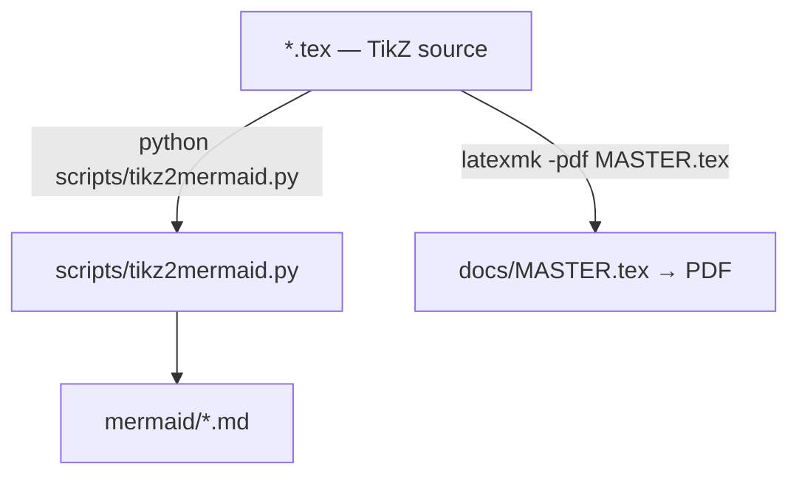

# docs/figures — TikZ sources and Mermaid conversions

*Created: 2026-08-31*

## Abstract — read this first

**What this directory is.** LaTeX/TikZ source files for the architectural
diagrams embedded in the ComplexGitSync documentation, together with a helper
script and their auto-generated Mermaid equivalents.

**Why it exists.** The canonical diagrams live as TikZ figures compiled by
`latexmk` into the PDF docs.  Mermaid versions are provided so the same
diagrams can be rendered directly in GitHub Markdown and other Markdown-aware
tools without a LaTeX installation.

**What you will find.** Each `*.tex` file here is a standalone TikZ or tabular
fragment `\input{}`-ed by the main doc sources.  The `mermaid/` sub-directory
holds one `*.md` file per `*.tex` file, generated by `scripts/tikz2mermaid.py`.

**Who it is for.** Contributors who want to update a diagram or regenerate the
Mermaid versions; readers who want to inspect diagrams in-browser without
building the PDFs.

**What you need to do with it.** After editing a `*.tex` file, run the
conversion script (see below) and commit both the source and the updated
`mermaid/*.md` file.



---

## TikZ source files

| File | Description |
|---|---|
| `branch_topology.tex` | Branch-propagation rules and tag-divergence illustration |
| `class_diagram.tex` | Core class model, GitTree lifecycle states, document hierarchy, registry model |
| `client_gating.tex` | Client state-gating of actions (READY / BLOCKED paths) |
| `gittree_nodes.tex` | WorkingRepo parent-leaf tree structure (ROOT / PARENT / LEAF) |
| `operations_sequence.tex` | Synchronized checkout / add / commit / push flow |
| `positioning_matrix.tex` | Architectural positioning table |
| `three_tier.tex` | Three-tier architecture overview |

---

## Regenerating the Mermaid files

The script `scripts/tikz2mermaid.py` converts every `*.tex` file in this
directory to a Mermaid `graph TD` block (or a Markdown table for tabular
environments) and writes the results to `docs/figures/mermaid/`.

**Quick start** — convert all figures:

```bash
python scripts/tikz2mermaid.py
```

**Convert a single file:**

```bash
python scripts/tikz2mermaid.py docs/figures/client_gating.tex
```

**Specify a custom output directory:**

```bash
python scripts/tikz2mermaid.py --output-dir /tmp/mermaid-preview
```

**Preview without writing files:**

```bash
python scripts/tikz2mermaid.py --dry-run
```

**Full option reference:**

```
usage: tikz2mermaid.py [-h] [--output-dir DIR] [--dry-run] [INPUT ...]

positional arguments:
  INPUT            One or more .tex files or directories (default: docs/figures)

options:
  --output-dir DIR  Directory for generated .md files (default: docs/figures/mermaid)
  --dry-run         Print what would be written without touching the filesystem
```

---

## Conversion fidelity

The converter performs a **best-effort structural translation**:

- TikZ nodes become Mermaid nodes; diamond/gate nodes become `{}` shape, all
  others become `[]` (rectangle).
- TikZ `\draw` arrows become Mermaid `-->` edges; dashed arrows become `-.->`.
- LaTeX markup (`\textbf`, `\textit`, `\texttt`, etc.) is stripped to plain text.
- Very long labels are truncated at 60 characters for readability.
- Absolute coordinates, custom colours, and layout hints are not preserved —
  Mermaid handles layout automatically.
- `\begin{tabular}` environments are converted to Markdown tables instead.

The TikZ source files remain the **authoritative** diagram definitions; the
Mermaid files are derived artifacts for convenience.
