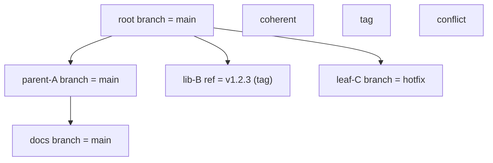

# branch_topology.tex — TikZ figure illustrating T35 branch topology propagation rules.

*Source: `docs/figures/branch_topology.tex`*

```mermaid
graph TD
    root["root branch = main"]
    child1["parent-A branch = main"]
    child2["lib-B ref = v1.2.3 (tag)"]
    child3["leaf-C branch = hotfix"]
    leaf1["docs branch = main"]
    leg1["coherent"]
    leg2["tag"]
    leg3["conflict"]
    root --> child1
    root --> child2
    root --> child3
    child1 --> leaf1
```
