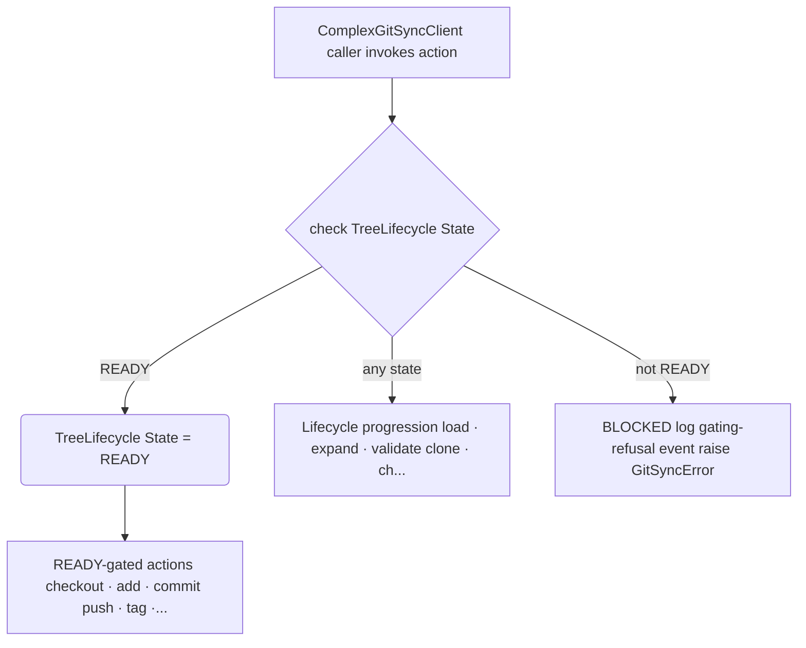

# client_gating.tex — TikZ figure showing Client state-gating of actions

*Source: `docs/figures/client_gating.tex`*

```mermaid
graph TD
    client["ComplexGitSyncClient caller invokes action"]
    gate{"check TreeLifecycle State"}
    readystate("TreeLifecycle State = READY")
    mutation["READY-gated actions checkout · add · commit push · tag ·..."]
    bootstrap["Lifecycle progression load · expand · validate clone · ch..."]
    blocked["BLOCKED log gating-refusal event raise GitSyncError"]
    client --> gate
    gate -->|"READY"| readystate
    readystate --> mutation
    gate -->|"any state"| bootstrap
    gate -->|"not READY"| blocked
```
