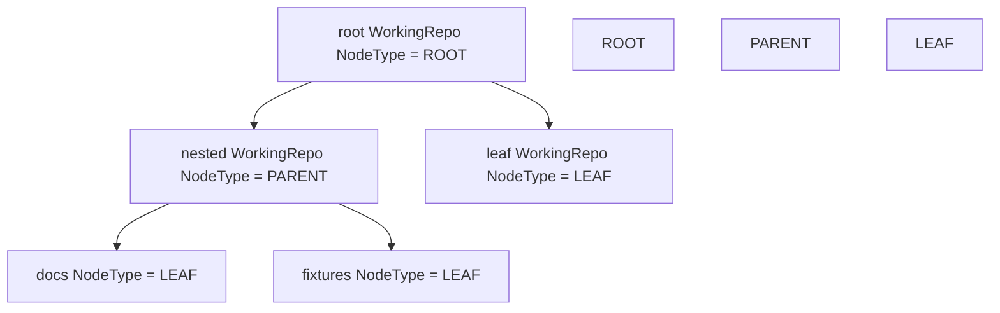

# gittree_nodes.tex — TikZ figure showing WorkingRepo parent-leaf tree structure

*Source: `docs/figures/gittree_nodes.tex`*

```mermaid
graph TD
    root["root WorkingRepo NodeType = ROOT"]
    parent["nested WorkingRepo NodeType = PARENT"]
    lib["leaf WorkingRepo NodeType = LEAF"]
    sub1["docs NodeType = LEAF"]
    sub2["fixtures NodeType = LEAF"]
    leg1["ROOT"]
    leg2["PARENT"]
    leg3["LEAF"]
    root --> parent
    root --> lib
    parent --> sub1
    parent --> sub2
```
