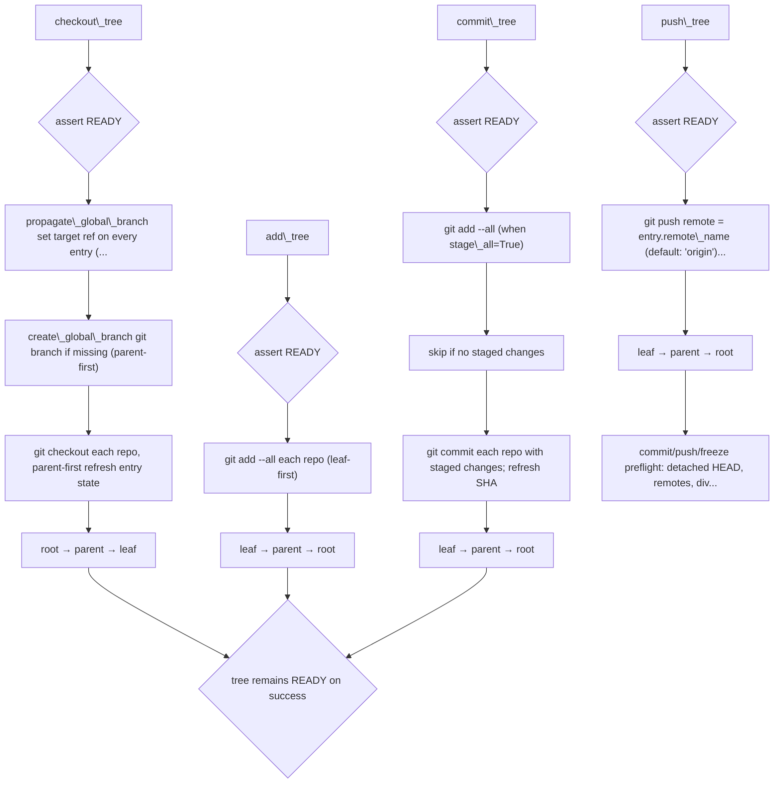

# operations_sequence.tex — TikZ figure showing the synchronized add/checkout/commit/push flow,

*Source: `docs/figures/operations_sequence.tex`*

```mermaid
graph TD
    co_title["checkout\_tree"]
    co_gate{"assert READY"}
    co_propagate["propagate\_global\_branch set target ref on every entry (..."]
    co_create["create\_global\_branch git branch if missing (parent-first)"]
    co_checkout["git checkout each repo, parent-first refresh entry state"]
    co_order["root → parent → leaf"]
    ad_title["add\_tree"]
    ad_gate{"assert READY"}
    ad_stage["git add --all each repo (leaf-first)"]
    ad_order["leaf → parent → root"]
    cm_title["commit\_tree"]
    cm_gate{"assert READY"}
    cm_stage["git add --all (when stage\_all=True)"]
    cm_skip["skip if no staged changes"]
    cm_commit["git commit each repo with staged changes; refresh SHA"]
    cm_order["leaf → parent → root"]
    pu_title["push\_tree"]
    pu_gate{"assert READY"}
    pu_push["git push remote = entry.remote\_name (default: 'origin')..."]
    pu_order["leaf → parent → root"]
    footer{"tree remains READY on success"}
    freeze_note["commit/push/freeze preflight: detached HEAD, remotes, div..."]
    co_title --> co_gate
    co_gate --> co_propagate
    co_propagate --> co_create
    co_create --> co_checkout
    co_checkout --> co_order
    ad_title --> ad_gate
    ad_gate --> ad_stage
    ad_stage --> ad_order
    cm_title --> cm_gate
    cm_gate --> cm_stage
    cm_stage --> cm_skip
    cm_skip --> cm_commit
    cm_commit --> cm_order
    pu_title --> pu_gate
    pu_gate --> pu_push
    pu_push --> pu_order
    co_order --> footer
    ad_order --> footer
    cm_order --> footer
    pu_order --> freeze_note
```
