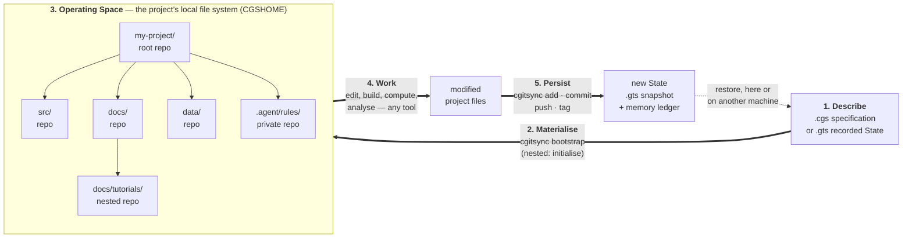

# project_lifecycle.tex — TikZ figure: the lifecycle of a project under ComplexGitSync

*Source: `docs/figures/project_lifecycle.tex`*

Written by hand rather than by `scripts/tikz2mermaid.py`, whose conversion of
this figure drops the fitted Operating Space box and the edge into it. This is
the same diagram as the root `README.md`'s *The project lifecycle*; keep the
two identical.

