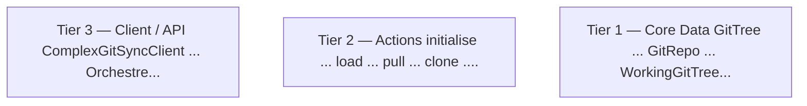

# three_tier.tex — TikZ figure showing the three-tier architecture

*Source: `docs/figures/three_tier.tex`*

```mermaid
graph TD
    api["Tier 3 — Client / API ComplexGitSyncClient ... Orchestre..."]
    actions["Tier 2 — Actions initialise ... load ... pull ... clone ...."]
    core["Tier 1 — Core Data GitTree ... GitRepo ... WorkingGitTree..."]
```
