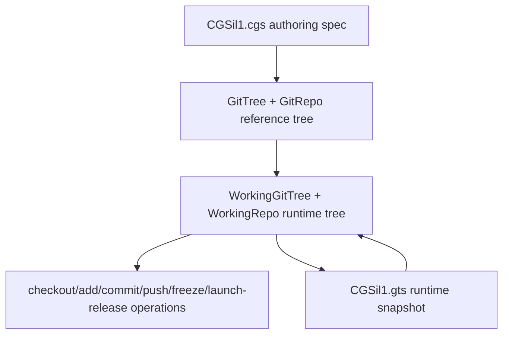

# Tutorial 1 of 3 — Your First Multi-Repo Workspace

*Created: 2026-06-30*

**Start here.** This is the easiest of the three tutorials in
[`docs/tutorials/`](README.md): it walks through the complete `cgitsync` CLI
lifecycle — validate, initialise, and the full git cycle
(add → commit → push → tag → freeze) — on a small, synthetic, mixed-provider
tree with every field left at its default. Nothing here requires a private
repository, real credentials, or an existing project to adopt.

The reference project is **CGSil1**, at
<https://gitlab.com/CGS_test/CGSil1>. It exists purely as a sandbox for this
tutorial; the topology it demonstrates is deliberately minimal so every
concept introduced here — `.cgs` authoring, the READY lifecycle, tree-wide
git operations, freeze/release — carries over unchanged to real projects.

> **Every command below is a Pixi task.** `cgitsync` is not a globally
> installed executable — always run it as `pixi run cgitsync ...`, never as
> a bare `cgitsync ...` (run `pixi install` once per checkout first).

> **Sandbox / CI note**
> The companion test file
> `tests/integration/test_tuto_cgsi1.py` reproduces every step below using
> local bare-repo remotes so that the tutorial can be verified in CI without
> any network access.

**Next:** once you're comfortable with the lifecycle above, move on to
[Tutorial 2 — Onboarding a Real Build Tree](02_onboarding_a_real_build_tree.md)
to see the same `.cgs` authoring style applied to a real, much larger
project.

---

## 1. Topology overview

The CGSil1 project demonstrates a minimal mixed-provider setup:

```
CGSil1  (GitLab, root)
  ├── CGSil2  (GitLab, child)    [nested_config = "auto"]
  └── CGSih1  (GitHub, child)    [nested_config = "auto"]
        └── CGSih2  (GitHub, leaf)  [nested_config = "auto", discovered transitively]
```

The current architecture separates the authoring topology from the runtime
workspace state:



`CGSil1.cgs` remains the source of truth for the reference tree. Runtime
commands load that reference into a `WorkingGitTree`, update repository
lifecycle and sync state there, and persist each generated `.gts` snapshot
under its own content-addressed `$CGSHOME/.cgitsync/state(<hash>)_<n>/`
directory, recorded in the project's `.lgr` register.

---

## 2. Project spec — CGSil1.cgs

Place the following file at the root of the CGSil1 repository:

```toml
project = "CGSil1"

repos = [
    "gitlab:CGS_test/CGSil1",
    "gitlab:CGS_test/CGSil2",
    "github:flipoyo/CGSih1",
]
```

The parser normalizes this authoring form before validation. It supplies
`main`, `ssh`, and `auto`, uses repository names as child paths, and infers
`CGSil1` as the root at `.` because its repository name uniquely matches the
project name.

### Paths and nested configuration

For a non-root repository, `relative_path` is resolved from its parent
repository directory—not from the shell's current directory. In a nested
`.cgs`, that parent is the repository described by the nested file. Omitting
the option places a repository at its repository name.

For example, `CGSil2.cgs` contains:

```toml
{ repository = "github:flipoyo/CGSih1", relative_path = "../CGSih1", nested_config = "disabled" }
```

The file describes children of `CGSil2`, so if `CGSil2` is at
`<CGSHOME>/CGSil2`, the path resolves as follows:

```text
<CGSHOME>/CGSil2/../CGSih1  ->  <CGSHOME>/CGSih1
```

This points to the existing `CGSih1` sibling already declared by
`CGSil1.cgs`; it does not request another clone inside `CGSil2`. The duplicate
absolute path is recognized and the canonical root-level entry is retained.

`nested_config` controls whether discovery continues inside the referenced
repository:

- `"auto"` (default) loads the sole root-level `*.cgs` file, if present; more
  than one is ambiguous and rejected.
- `"disabled"` does not inspect that repository for another `.cgs` file.
- A relative `.cgs` path, such as `"config/children.cgs"`, loads that exact file
  from inside the repository and may not escape it.

Thus the CGSil2 cross-reference uses `"disabled"`: the canonical `CGSih1`
entry from `CGSil1.cgs`, not this duplicate route, owns discovery of
`CGSih1.cgs` and its `CGSih2` child.

For a new project, the interactive equivalent is:

```bash
pixi run cgitsync configure --output ../CGSil1.cgs
```

The command builds a `GitTree` reference tree from prompts, validates the
generated `CgsDocument`, and writes the `.cgs` file. The checked-in tutorial
fixture is shown explicitly above so the CI sandbox can reproduce the same
topology without interactive input.

---

## 3. Step-by-step CLI walkthrough

Before starting, keep in mind that `CGSHOME=$CGSPATH/CGSil1`,
`CWD=$CGSHOME/ComplexGitSync`, and commands are run from `$CWD`.
When `--output-path` is omitted, `pixi run cgitsync initialise` behaves as if
`--output-path $CGSPATH` had been passed, with the default `CGSPATH=../..`
relative to `$CWD`. The `.cgs` file is read first, then `CGSHOME` is derived
from the project name; child repositories such as `CGSil2` and `CGSih1` are
cloned under that project root.

### Step 1 — Validate the topology

Install the project repo:
```bash
git clone https://gitlab.com/CGS_test/CGSil1
cd CGSil1
git clone https://github.com/flipoyo/ComplexGitSync
cd ComplexGitSync
```


Parses the spec and checks consistency without cloning anything:

```bash
pixi run cgitsync validate ../CGSil1.cgs
```

Expected output (tree not yet cloned, so `DECLARED`):

```
DECLARED ready=false complete=true
```

---

### Step 2 — View a tree summary

Renders the project tree with lifecycle state:

```bash
pixi run cgitsync view-tree ../CGSil1.cgs
```

---

### Step 3 — Initialise the workspace

Uses `$CGSHOME` as the existing root project, clones all child repositories
under that root, and writes the first runtime `.gts` snapshot:

```bash
pixi run cgitsync initialise ../CGSil1.cgs
```

The explicit equivalent is:

```bash
pixi run cgitsync initialise ../CGSil1.cgs --output-path "$CGSPATH"
```

Expected output (all repos cloned, tree is `READY`):

```
operation_sequence=GT-LOAD->GT-DISCOVER->GT-VALIDATE->GT-CLONE->GT-GITIGNORE
workflow=load->expand->validate->clone->gitignore
git_command=git clone (executed per repo)
READY ready=true complete=true root=/path/to/CGSil1
```

`GT-GITIGNORE` is the `.gitignore` lifecycle sync: every repo with children
(root, or any nested repo with further nested children) is safely pulled
and has its `.gitignore` updated with the relative path of each immediate
child, since nested repos are plain independent clones, not gitlinks. By
default this only writes the file and reports what changed
(`.gitignore updated (not committed): ...`) — pass `--commit-gitignore` to
also stage/commit/push it, and `--git-user-name`/`--git-user-email` to
override the commit identity (persisted to `$CGSHOME/.cgitsync/master.toml`
for later invocations on this workspace). If a repo's safe pull fails here,
`initialise` errors out unless `--force-gitignore-sync` is passed.

A runtime snapshot is written under `$CGSHOME/.cgitsync/` and recorded in
the project's `.lgr` register. Subsequent commands resolve this snapshot
automatically — no explicit `.gts` path is required.

If a previous failed run left partial child checkouts, `initialise` fails
explicitly and prints:

```
Try clean-init method
```

In that case, rerun the same setup with a cleanup step inserted between
validation and cloning:

```bash
pixi run cgitsync clean-init ../CGSil1.cgs
```

`clean-init` prints
`operation_sequence=GT-LOAD->GT-DISCOVER->GT-VALIDATE->FS-PURGE->GT-CLONE->GT-GITIGNORE`
and `workflow=load->expand->validate->purge->clone->gitignore`. The `purge`
phase removes generated clone state from `$CGSHOME`: repositories declared
directly under the root and project `*.lgr` files — a persisted
`.cgitsync/master.toml` identity override, if any, is workspace
configuration, not clone state, and is left in place. The cleanup can also
be run alone:

```bash
pixi run cgitsync purge ../CGSil1.cgs
```

---

### Step 4 — Pull

Resynchronise the existing workspace from the current root branch:

```bash
pixi run cgitsync pull
```

`pull` includes the project root repository. It runs parent-first:
`ROOT -> PARENT -> LEAF`, pulling every repository — root, parent, and leaf
alike — as its own plain `git pull`.
If local files block this safe pull, the CLI suggests `pixi run cgitsync pull-force`.
Use that recovery command only when discarding local uncommitted and untracked
work is acceptable.

`pull` also runs the same `.gitignore` lifecycle sync as `initialise` (Step 3
above) once the tree-wide pull completes, and accepts the same
`--commit-gitignore`/`--force-gitignore-sync`/`--git-user-name`/
`--git-user-email` flags. `pull-force` does not run this sync — it is a
destructive recovery command, not a lifecycle path the sync is wired into.

---

### Step 5 — Stage changes

Stage all uncommitted file changes across every repository in the tree:

```bash
pixi run cgitsync add
```

The command discovers the `.gts` snapshot automatically via the project's
`.lgr` register under `$CGSHOME/.cgitsync/`. Use `--gts` to pass the path
explicitly:

```bash
pixi run cgitsync add --gts "/path/to/workspace/.cgitsync/state(<hash>)_<n>/CGSil1.gts"
```

Mutation commands run leaf-first: `LEAF -> PARENT -> ROOT`.

---

### Step 6 — Commit

Commit staged changes with a shared message across all dirty repositories:

```bash
pixi run cgitsync commit "my commit message"
```

Equivalent form:

```bash
pixi run cgitsync commit -m "my commit message"
```

---

### Step 7 — Push

Push every repository to its configured remote, leaf-first:

```bash
pixi run cgitsync push
```

Optional inspection after push:

```bash
pixi run cgitsync status
```

---

### Step 8 — Freeze

Minimalist release workflow: stage, commit, pull, push, freeze, and emit a
versioned `.gts` snapshot:

```bash
pixi run cgitsync freeze-release v1.1.0 "release v1.1.0"
```

Expert equivalent for the final freeze step:

```bash
pixi run cgitsync freeze v1.1.0
```

The `.lgr` ledger file in the project root is updated with the new
snapshot entry.

---

### Step 9 — Launch Release

Check out the frozen release tag across the READY tree:

```bash
pixi run cgitsync launch-release v1.1.0
```

---

## 4. Summary

| Step | Command | Description |
|------|---------|-------------|
| 1 | `pixi run cgitsync validate ../CGSil1.cgs` | Parse and check the topology |
| 2 | `pixi run cgitsync view-tree ../CGSil1.cgs` | Render the tree summary |
| 3 | `pixi run cgitsync initialise ../CGSil1.cgs` | Attach the root repo and clone child repos |
| recovery | `pixi run cgitsync clean-init ../CGSil1.cgs` | Purge generated clone state, then initialise |
| cleanup | `pixi run cgitsync purge ../CGSil1.cgs` | Remove root-level generated clone state |
| 4 | `pixi run cgitsync pull` | Resync root, parent, and leaf repos |
| 5 | `pixi run cgitsync add` | Stage all changes |
| 6 | `pixi run cgitsync commit "message"` | Commit across the tree |
| 7 | `pixi run cgitsync push` | Push to remotes |
| optional | `pixi run cgitsync status` | Inspect local cleanliness and recorded snapshot drift |
| 8 | `pixi run cgitsync freeze-release v1.1.0 "release v1.1.0"` | Minimalist release workflow |
| expert | `pixi run cgitsync freeze v1.1.0` | Expert release commit + tag + snapshot |
| 9 | `pixi run cgitsync launch-release v1.1.0` | Check out the frozen release tag |

See `tests/integration/test_tuto_cgsi1.py` for a runnable sandbox that
exercises the full workflow against local bare-repo remotes.

